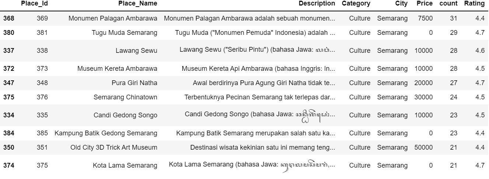

# Indonesian tourist destinations recommendation system

## About This Project
This is a project to create a recommendation system based on the most popular, similar content, preferences of other people. The purpose of this project is to be able to provide content that is in accordance with what the user wants. 

<h3>- The results of recommendations based on the most ratings in tourist attractions in the city of Semarang, Indonesia : </h3>

<h3>- Based on content : </h3>

The recommendation results from the content are : 

## Technology, dataset, technique used :
1. Machine Learning
   - [Python](https://www.python.org/)
   - [NMF](https://en.wikipedia.org/wiki/Non-negative_matrix_factorization)
   - [CountVectorizer](https://scikit-learn.org/stable/modules/generated/sklearn.feature_extraction.text.CountVectorizer.html)
2. Dataset
   - [Kaggle.com](https://www.kaggle.com/datasets/aprabowo/indonesia-tourism-destination) 
3. recommender system technique
   - [Based on the most popular content](https://en.wikipedia.org/wiki/Recommender_system)
   - [Collaborative filtering](https://en.wikipedia.org/wiki/Recommender_system)
   - [Content-based filtering](https://en.wikipedia.org/wiki/Recommender_system)
